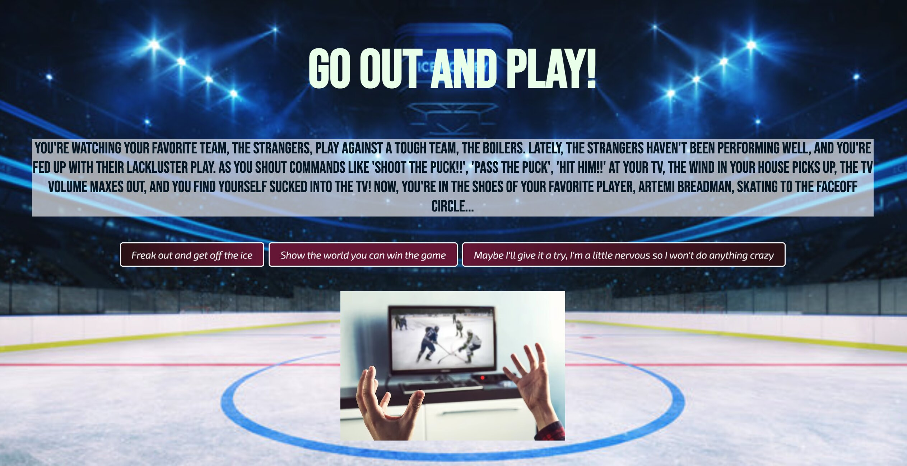
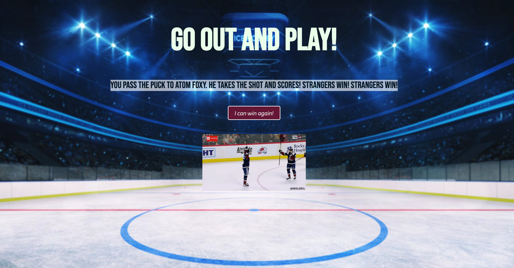

# Go Out and Play!

## Objective

Sports fans watch their favorite teams and yell at the players what they would do if they were playing. But, is your strategy really the best option? Now it's your turn to go out and play the game and prove that you will score and win the game. You must choose the correct option to continue onto the next situation to eventually score a goal. But be careful! If you choose the wrong option, there's a chance you might make a mistake and lose the game for your team. 

## Getting Started

While watching your favorite hockey team, you are shouting at your team to shoot and pass. You feel a gust of wind and before you know it you're playing in the game! You must read each situation and choose one of the options available to continue playing the game. Play until you win or lose, you always have the option to play again!

Start playing [here](https://go-out-and-play.netlify.app)

## Screenshots
### Start Screen
#### You will be greeted with your initial situation. Make sure you have the confidence to play!

### GamePlay
#### You win the game after you successfully answer all the situations correctly!

## Technologies Used
- JavaScript
- CSS
- HTML
- Git

## Attributions
- Audio file framework: https://github.com/SEI-Remote/shake-it-off/tree/main
- gifs: https://giphy.com/search/hockey
- Online Image converter to JPEG: https://image.online-convert.com/convert-to-jpg
- Audio file converter to mp3: https://aiseesoft-video-converter-ultimate.en.softonic.com/

## Future Goals
- [ ] Add a timer for each situation
- [ ] Include original animations
- [ ] Include more situations and more options
- [ ] Make it compatible for mobile devices

